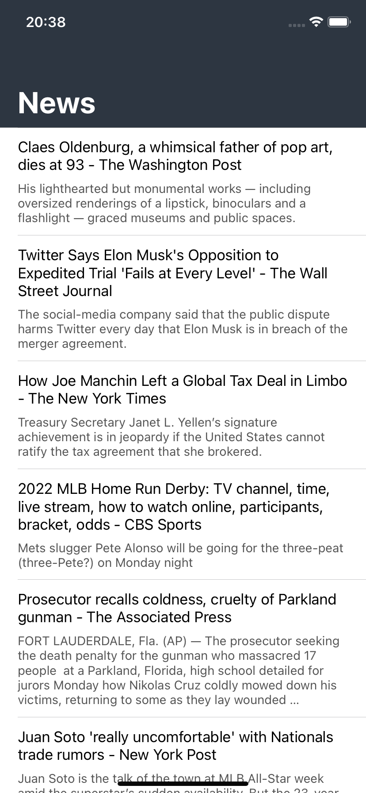

# News
> Aplicativo para desenvolvimento Swift/iOS - MVVM

## Conceitos abordados

* Linguagem
    * Swift 5.5

* Auto Layout
    * Constraint

* Components
    * UIView
    * UILabel
    * StackView
    * UITableView
    * UINavigationController
        * Large Title
    * Propriedades computadas

## Snapshots

  
 
